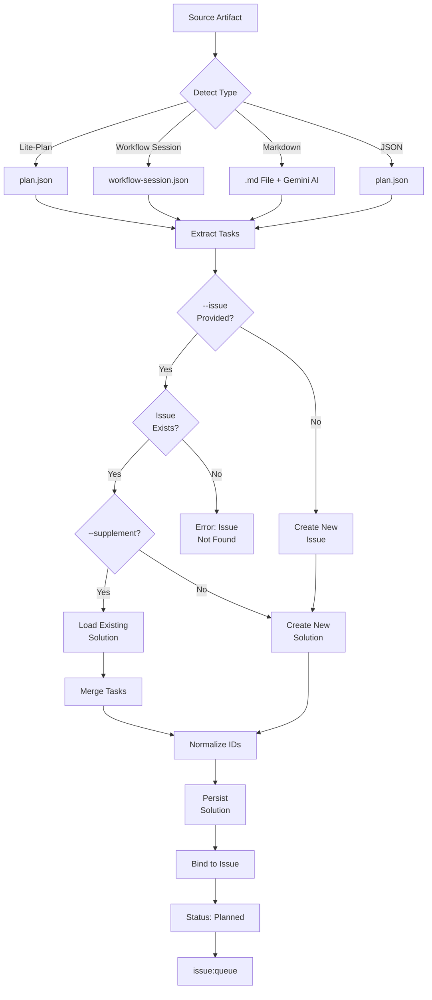

# issue:convert-to-plan

将各种规划产物格式（lite-plan、工作流会话、Markdown、JSON）转换为 Issue 工作流解决方案，支持智能检测和自动绑定。

## 描述

`issue:convert-to-plan` 命令桥接外部规划工作流和 Issue 系统。它自动检测源格式、提取任务结构、规范化为解决方案 Schema，并创建新 Issue 或补充现有解决方案。

### 关键特性

- **多格式支持**：lite-plan、工作流会话、Markdown、JSON
- **自动检测**：自动识别源类型
- **AI 辅助提取**：使用 Gemini CLI 解析 Markdown
- **补充模式**：向现有解决方案添加任务
- **自动绑定**：解决方案自动绑定到 Issue
- **Issue 自动创建**：需要时从计划创建 Issue

## 用法

```bash
# 将 lite-plan 转换为新 Issue（自动创建 Issue）
/issue:convert-to-plan ".workflow/.lite-plan/implement-auth-2026-01-25"

# 将工作流会话转换为现有 Issue
/issue:convert-to-plan WFS-auth-impl --issue GH-123

# 将 Markdown 文件转换为 Issue
/issue:convert-to-plan "./docs/implementation-plan.md"

# 向现有解决方案补充额外任务
/issue:convert-to-plan "./docs/additional-tasks.md" --issue ISS-001 --supplement

# 自动模式 - 跳过确认
/issue:convert-to-plan ".workflow/.lite-plan/my-plan" -y
```

### 参数

| 参数 | 必填 | 描述 |
|----------|----------|-------------|
| `SOURCE` | 是 | 规划产物路径或 WFS-xxx ID |
| `--issue <id>` | 否 | 绑定到现有 Issue 而非创建新的 |
| `--supplement` | 否 | 向现有解决方案添加任务（需要 --issue） |
| `-y, --yes` | 否 | 跳过所有确认 |

## 示例

### 转换 Lite-Plan

```bash
/issue:convert-to-plan ".workflow/.lite-plan/implement-auth"
# Output:
# Detected source type: lite-plan
# Extracted: 5 tasks
# Created issue: ISS-20250129-001 (priority: 3)
# ✓ Created solution: SOL-ISS-20250129-001-a7b3
# ✓ Bound solution to issue
# → Status: planned
```

### 转换工作流会话

```bash
/issue:convert-to-plan WFS-auth-impl --issue GH-123
# Output:
# Detected source type: workflow-session
# Loading session: .workflow/active/WFS-auth-impl/
# Extracted: 8 tasks from session
# ✓ Created solution: SOL-GH-123-c9d2
# ✓ Bound solution to issue GH-123
```

### 使用 AI 转换 Markdown

```bash
/issue:convert-to-plan "./docs/api-redesign.md"
# Output:
# Detected source type: markdown-file
# Using Gemini CLI for intelligent extraction...
# Extracted: 6 tasks
# Created issue: ISS-20250129-002 (priority: 2)
# ✓ Created solution: SOL-ISS-20250129-002-e4f1
```

### 补充现有解决方案

```bash
/issue:convert-to-plan "./docs/tasks-phase2.md" --issue ISS-001 --supplement
# Output:
# Loaded existing solution: SOL-ISS-001-a7b3 (3 tasks)
# Extracted: 2 new tasks
# Supplementing: 3 existing + 2 new = 5 total tasks
# ✓ Updated solution: SOL-ISS-001-a7b3
```

## Issue 生命周期流程



## 支持的来源

### 1. Lite-Plan

**位置**：`.workflow/.lite-plan/{slug}/plan.json`

**Schema**：
```typescript
interface LitePlan {
  summary: string;
  approach: string;
  complexity: 'low' | 'medium' | 'high';
  estimated_time: string;
  tasks: LiteTask[];
  _metadata: {
    timestamp: string;
    exploration_angles: string[];
  };
}

interface LiteTask {
  id: string;
  title: string;
  scope: string;
  action: string;
  description: string;
  modification_points: Array<{file, target, change}>;
  implementation: string[];
  acceptance: string[];
  depends_on: string[];
}
```

### 2. 工作流会话

**位置**：`.workflow/active/{session}/` 或 `WFS-xxx` ID

**文件**：
- `workflow-session.json` - 会话元数据
- `IMPL_PLAN.md` - 实现计划（可选）
- `.task/IMPL-*.json` - 任务定义

**提取**：
```typescript
// From workflow-session.json
{
  title: session.name,
  description: session.description,
  session_id: session.id
}

// From IMPL_PLAN.md
approach: Extract overview section

// From .task/IMPL-*.json
tasks: Map IMPL-001 → T1, IMPL-002 → T2...
```

### 3. Markdown 文件

**任何包含实现/任务内容的 `.md` 文件**

**AI 提取**（通过 Gemini CLI）：
```javascript
// Prompt Gemini to extract structure
{
  title: "Extracted from document",
  approach: "Technical strategy section",
  tasks: [
    {
      id: "T1",
      title: "Parsed from headers/lists",
      scope: "inferred from content",
      action: "detected from verbs",
      implementation: ["step 1", "step 2"],
      acceptance: ["criteria 1", "criteria 2"]
    }
  ]
}
```

### 4. JSON 文件

**直接匹配 plan-json-schema 的 JSON**

```typescript
interface JSONPlan {
  summary?: string;
  title?: string;
  description?: string;
  approach?: string;
  complexity?: 'low' | 'medium' | 'high';
  tasks: JSONTask[];
  _metadata?: object;
}
```

## 任务规范化

### ID 规范化

```javascript
// Various input formats → T1, T2, T3...
"IMPL-001" → "T1"
"IMPL-01" → "T1"
"task-1" → "T1"
"1" → "T1"
"T-1" → "T1"
```

### 依赖规范化

```javascript
// Normalize all references to T-format
depends_on: ["IMPL-001", "task-2"]
// → ["T1", "T2"]
```

### Action 验证

```javascript
// Valid actions (case-insensitive, auto-capitalized)
['Create', 'Update', 'Implement', 'Refactor',
 'Add', 'Delete', 'Configure', 'Test', 'Fix']

// Invalid actions → Default to 'Implement'
'build' → 'Implement'
'write' → 'Create'
```

## 解决方案 Schema

所有提取数据的目标格式：

```typescript
interface Solution {
  id: string;                    // SOL-{issue-id}-{4-char-uid}
  description?: string;          // 高级摘要
  approach?: string;             // 技术策略
  tasks: Task[];                 // 必填：至少 1 个任务
  exploration_context?: object;  // 可选：来源上下文
  analysis?: {
    risk: 'low' | 'medium' | 'high';
    impact: 'low' | 'medium' | 'high';
    complexity: 'low' | 'medium' | 'high';
  };
  score?: number;                // 0.0-1.0
  is_bound: boolean;
  created_at: string;
  bound_at?: string;
  _conversion_metadata?: {
    source_type: string;
    source_path: string;
    converted_at: string;
  };
}

interface Task {
  id: string;                    // T1, T2, T3...
  title: string;                 // 必填：动词 + 目标
  scope: string;                 // 必填：模块路径或功能领域
  action: Action;                // 必填：Create|Update|Implement...
  description?: string;
  modification_points?: Array<{file, target, change}>;
  implementation: string[];      // 必填：分步指南
  test?: {
    unit?: string[];
    integration?: string[];
    commands?: string[];
    coverage_target?: string;
  };
  acceptance: {
    criteria: string[];
    verification: string[];
  };
  commit?: {
    type: string;
    scope: string;
    message_template: string;
    breaking?: boolean;
  };
  depends_on?: string[];
  priority?: number;             // 1-5（默认：3）
}

type Action = 'Create' | 'Update' | 'Implement' | 'Refactor' |
             'Add' | 'Delete' | 'Configure' | 'Test' | 'Fix';
```

## 优先级自动检测

从计划创建新 Issue 时：

```javascript
const complexityMap = {
  high: 2,    // 高复杂度 → 优先级 2（高）
  medium: 3,  // 中复杂度 → 优先级 3（中）
  low: 4      // 低复杂度 → 优先级 4（低）
};

// 未指定复杂度时，默认为 3
const priority = complexityMap[plan.complexity?.toLowerCase()] || 3;
```

## 错误处理

| 错误代码 | 消息 | 解决方案 |
|------------|---------|------------|
| **E001** | Source not found: `{path}` | 检查路径是否存在且可访问 |
| **E002** | Unable to detect source format | 验证文件包含有效的计划结构 |
| **E003** | Issue not found: `{id}` | 检查 Issue ID 或省略 --issue 创建新的 |
| **E004** | Issue already has bound solution | 使用 --supplement 添加任务 |
| **E005** | Failed to extract tasks from markdown | 检查 Markdown 结构，尝试更简单的格式 |
| **E006** | No tasks extracted from source | 来源必须包含至少 1 个任务 |

## CLI 端点

```bash
# Create new issue
ccw issue create << 'EOF'
{"title":"...","context":"...","priority":3,"source":"converted"}
EOF

# Check issue exists
ccw issue status <id> --json

# Get existing solution
ccw issue solution <solution-id> --json

# Bind solution to issue
ccw issue bind <issue-id> <solution-id>

# Update issue status
ccw issue update <issue-id> --status planned
```

## 相关命令

- **[issue:plan](./issue-plan.md)** - 从 Issue 探索生成解决方案
- **[issue:new](./issue-new.md)** - 从 GitHub 或文本创建 Issue
- **[issue:queue](./issue-queue.md)** - 从转换的计划形成执行队列
- **[issue:execute](./issue-execute.md)** - 执行转换的解决方案
- **[workflow:lite-lite-lite](#)** - 生成 lite-plan 产物
- **[workflow:execute](#)** - 生成工作流会话

## 最佳实践

1. **验证源格式**：转换前确保计划具有有效结构
2. **检查现有解决方案**：使用 --supplement 添加任务，而非替换
3. **审查提取的任务**：验证 AI 提取 Markdown 的准确性
4. **手动规范化**：如需编辑任务 ID 和依赖关系
5. **先在补充模式测试**：在创建新 Issue 前先向现有解决方案添加任务
6. **保留源产物**：转换后不要删除原始计划文件
