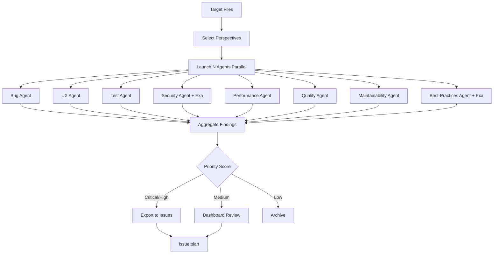

# issue:discover

多视角 Issue 发现编排器，从不同角度探索代码以识别潜在的 Bug、用户体验改进、测试缺口及其他可操作项。

## 描述

`issue:discover` 命令使用并行 CLI Agent 从 8 个专业视角（bug、ux、test、quality、security、performance、maintainability、best-practices）分析代码。它聚合发现结果，并可将高优先级发现导出为 Issue。

### 关键特性

- **8 种分析视角**：针对不同关注领域的专业分析
- **并行执行**：多个 Agent 同时运行以提高速度
- **外部研究**：集成 Exa 进行安全和最佳实践基准测试
- **仪表盘集成**：通过 CCW 仪表盘查看和过滤发现
- **智能优先级**：自动严重性评分和去重
- **直接导出**：一键将发现转换为 Issue

## 用法

```bash
# 交互式视角选择
/issue:discover src/auth/**

# 指定视角
/issue:discover src/payment/** --perspectives=bug,security,test

# 启用外部研究
/issue:discover src/api/** --external

# 自动模式 - 所有视角
/issue:discover src/** --yes

# 多模块
/issue:discover src/auth/**,src/payment/**
```

### 参数

| 参数 | 必填 | 描述 |
|----------|----------|-------------|
| `path-pattern` | 是 | 要分析的文件 Glob 模式 |
| `--perspectives` | 否 | 逗号分隔的列表（默认：交互式选择） |
| `--external` | 否 | 启用 Exa 外部研究 |
| `-y, --yes` | 否 | 自动选择所有视角 |

## 视角

### 可用的分析类型

| 视角 | 关注领域 | 分类 |
|-------------|-------------|------------|
| **bug** | 边界情况、空值检查、资源泄漏 | edge-case, null-check, race-condition, boundary |
| **ux** | 用户体验问题 | error-message, loading-state, accessibility, feedback |
| **test** | 测试覆盖缺口 | missing-test, edge-case-test, integration-gap |
| **quality** | 代码质量问题 | complexity, duplication, naming, code-smell |
| **security** | 安全漏洞 | injection, auth, encryption, input-validation |
| **performance** | 性能瓶颈 | n-plus-one, memory-usage, caching, algorithm |
| **maintainability** | 代码可维护性 | coupling, cohesion, tech-debt, module-boundary |
| **best-practices** | 行业最佳实践 | convention, pattern, framework-usage |

## 示例

### 快速扫描（推荐）

```bash
/issue:discover src/auth/**
# Interactive prompt:
#   Select primary discovery focus:
#   [1] Bug + Test + Quality (Recommended)
#   [2] Security + Performance
#   [3] Maintainability + Best-practices
#   [4] Full analysis
```

### 带外部研究的安全审计

```bash
/issue:discover src/payment/** --perspectives=security --external
# 使用 Exa 研究 OWASP 支付安全标准
# 将实现与行业基准进行对比
```

### 自动模式完整分析

```bash
/issue:discover src/api/** --yes
# 并行运行所有 8 个视角
# 无需确认，处理所有发现
```

## Issue 生命周期流程



## 发现输出结构

### 目录布局

```
.workflow/issues/discoveries/
├── {discovery-id}/
│   ├── discovery-state.json          # 会话状态机
│   ├── perspectives/
│   │   ├── bug.json                  # Bug 发现
│   │   ├── ux.json                   # UX 发现
│   │   ├── security.json             # 安全发现
│   │   └── ...
│   ├── external-research.json        # Exa 结果（如启用）
│   ├── discovery-issues.jsonl        # 导出的候选 Issue
│   └── summary.md                    # 汇总报告
```

### 发现 Schema

```typescript
interface DiscoveryFinding {
  id: string;
  perspective: string;
  title: string;
  priority: 'critical' | 'high' | 'medium' | 'low';
  category: string;
  description: string;
  file: string;
  line: number;
  snippet: string;
  suggested_issue: string;
  confidence: number;
  priority_score: number;
}
```

## 优先级分类

### 严重（自动导出）

- 数据损坏风险
- 安全漏洞（认证绕过、注入）
- 内存泄漏
- 竞态条件
- 严重的可访问性问题

### 高（建议导出）

- 缺失核心功能测试
- 显著的用户体验混乱
- N+1 查询问题
- 明确的安全缺口
- 重大代码异味

### 中（仪表盘审查）

- 边界情况缺口
- 不一致的模式
- 轻微性能问题
- 文档缺口
- 风格违规

### 低（信息性）

- 外观问题
- 轻微命名不一致
- 优化机会
- 锦上添花的改进

## 仪表盘集成

### 查看发现

```bash
# 打开 CCW 仪表盘
ccw view

# 导航到：Issues > Discovery
```

**功能**：
- 查看所有发现会话
- 按视角和优先级过滤
- 预览发现详情和代码片段
- 批量选择发现进行导出
- 跨会话比较发现

### 导出为 Issue

从仪表盘：
1. 选择要导出的发现
2. 点击 "Export as Issues"
3. 发现转换为标准 Issue 格式
4. 追加到 `.workflow/issues/issues.jsonl`
5. 状态设置为 `registered`
6. 继续 `/issue:plan` 工作流

## Exa 外部研究

### 安全视角

研究内容：
- 您技术栈的 OWASP Top 10
- 行业标准安全模式
- 您框架中的常见漏洞
- 针对您具体用例的最佳实践

### 最佳实践视角

研究内容：
- 框架特定的约定
- 语言惯用法和模式
- 已弃用 API 警告
- 社区推荐的方法

## 相关命令

- **[issue:new](./issue-new.md)** - 从发现创建 Issue
- **[issue:plan](./issue-plan.md)** - 为发现的 Issue 规划解决方案
- **[issue:manage](#)** - 交互式 Issue 管理仪表盘
- **[review-code](#)** - 代码审查用于质量评估

## 最佳实践

1. **聚焦开始**：从特定模块开始，而非整个代码库
2. **先快速扫描**：使用 bug+test+quality 获得快速结果
3. **导出前审查**：并非所有发现都值得创建 Issue
4. **策略性启用 Exa**：用于不熟悉的技术或安全审计
5. **组合视角**：一起运行相关视角（例如 security+bug）
6. **迭代进行**：每个 Sprint 后对变更模块运行发现

## 对比：发现 vs 代码审查

| 方面 | issue:discover | review-code |
|--------|----------------|-------------|
| **目的** | 发现可操作的 Issue | 评估代码质量 |
| **输出** | 可导出的 Issue | 质量报告 |
| **视角** | 8 个专业角度 | 7 个质量维度 |
| **外部研究** | 是（Exa） | 否 |
| **仪表盘集成** | 是 | 否 |
| **使用时机** | 主动 Issue 发掘 | 提交后审查 |
