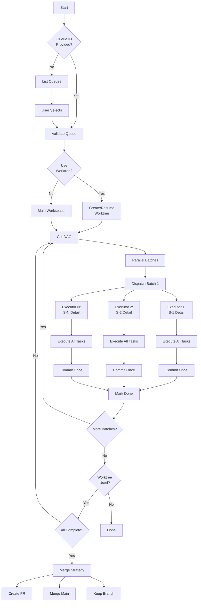

# issue:execute

最小化编排器，将解决方案 ID 分派给执行器。每个执行器接收包含所有任务的完整解决方案，并在每个解决方案完成后提交一次。

## 描述

`issue:execute` 命令使用基于 DAG 的并行编排执行排队的解决方案。每个执行器处理解决方案中的所有任务，按顺序执行任务，并在每个解决方案完成后提交一次。支持可选的 git worktree 隔离以实现干净的工作区管理。

### 关键特性

- **基于 DAG 的并行**：自动并行执行独立解决方案
- **解决方案级执行**：每个执行器处理解决方案中的所有任务
- **单次提交**：每个解决方案一次提交，保持干净的 git 历史
- **Worktree 隔离**：可选的隔离工作区用于队列执行
- **多执行器**：支持 Codex、Gemini 或 Agent
- **恢复能力**：使用现有 worktree 从中断中恢复

## 用法

```bash
# 执行指定队列（必填）
/issue:execute --queue QUE-xxx

# 在隔离的 worktree 中执行
/issue:execute --queue QUE-xxx --worktree

# 在现有 worktree 中恢复
/issue:execute --queue QUE-xxx --worktree /path/to/worktree

# 试运行（显示 DAG 但不执行）
/issue:execute --queue QUE-xxx
# 选择：Dry-run mode
```

### 参数

| 参数 | 必填 | 描述 |
|----------|----------|-------------|
| `--queue <id>` | 是 | 要执行的队列 ID（必填） |
| `--worktree` | 否 | 创建隔离的 worktree 用于执行 |
| `--worktree <path>` | 否 | 在现有 worktree 中恢复 |

### 执行器选择

交互式提示选择：
- **Codex**（推荐）：2 小时超时的自主编码
- **Gemini**：大上下文分析和实现
- **Agent**：用于复杂任务的 Claude Code 子 Agent

## 示例

### 执行队列（交互式）

```bash
/issue:execute --queue QUE-20251227-143000
# Output:
# ## Executing Queue: QUE-20251227-143000
# ## Queue DAG (Solution-Level)
# - Total Solutions: 5
# - Ready: 2
# - Completed: 0
# - Parallel in batch 1: 2
#
# Select executor:
#   [1] Codex (Recommended)
#   [2] Gemini
#   [3] Agent
# Select mode:
#   [1] Execute (Recommended)
#   [2] Dry-run
# Use git worktree?
#   [1] Yes (Recommended)
#   [2] No
```

### 未提供队列 ID

```bash
/issue:execute
# Output:
# Available Queues:
# ID                    Status      Progress    Issues
# -----------------------------------------------------------
# → QUE-20251215-001   active      3/10        ISS-001, ISS-002
#   QUE-20251210-002   active      0/5         ISS-003
#   QUE-20251205-003   completed   8/8         ISS-004
#
# Which queue would you like to execute?
#   [1] QUE-20251215-001 - 3/10 completed, Issues: ISS-001, ISS-002
#   [2] QUE-20251210-002 - 0/5 completed, Issues: ISS-003
```

### 使用 Worktree 执行

```bash
/issue:execute --queue QUE-xxx --worktree
# Output:
# Created queue worktree: /repo/.ccw/worktrees/queue-exec-QUE-xxx
# Branch: queue-exec-QUE-xxx
# ### Executing Solutions (DAG batch 1): S-1, S-2
# [S-1] Executor launched (codex, 2hr timeout)
# [S-2] Executor launched (codex, 2hr timeout)
# ✓ S-1 completed: 3 tasks, 1 commit
# ✓ S-2 completed: 2 tasks, 1 commit
```

### 恢复现有 Worktree

```bash
# Find existing worktrees
git worktree list
# /repo/.ccw/worktrees/queue-exec-QUE-123

# Resume execution
/issue:execute --queue QUE-123 --worktree /repo/.ccw/worktrees/queue-exec-QUE-123
# Output:
# Resuming in existing worktree: /repo/.ccw/worktrees/queue-exec-QUE-123
# Branch: queue-exec-QUE-123
# ### Executing Solutions (DAG batch 2): S-3
```

## Issue 生命周期流程



## 执行模型

### 基于 DAG 的批处理

```
Batch 1 (Parallel): S-1, S-2  → No file conflicts
Batch 2 (Parallel): S-3, S-4  → No conflicts, waits for Batch 1
Batch 3 (Sequential): S-5     → Depends on S-3
```

### 解决方案执行（执行器内部）

```
ccw issue detail S-1  → Get full solution with all tasks
↓
For each task T1, T2, T3...:
  - Follow implementation steps
  - Run test commands
  - Verify acceptance criteria
↓
After ALL tasks pass:
  git commit -m "feat(scope): summary

  Solution: S-1
  Tasks completed: T1, T2, T3

  Changes:
  - file1: what changed
  - file2: what changed

  Verified: all tests passed"
↓
ccw issue done S-1 --result '{summary, files, commit}'
```

## 执行器分派

### Codex 执行器

```bash
ccw cli -p "## Execute Solution: S-1
..." --tool codex --mode write --id exec-S-1
# Timeout: 2 hours (7200000ms)
# Background: true
```

### Gemini 执行器

```bash
ccw cli -p "## Execute Solution: S-1
..." --tool gemini --mode write --id exec-S-1
# Timeout: 1 hour (3600000ms)
# Background: true
```

### Agent 执行器

```javascript
Task({
  subagent_type: 'code-developer',
  run_in_background: false,
  description: 'Execute solution S-1',
  prompt: '...'  // Full execution prompt
})
```

## Worktree 管理

### 创建新 Worktree

```bash
# 整个队列执行使用一个 worktree
git worktree add .ccw/worktrees/queue-exec-QUE-xxx -b queue-exec-QUE-xxx
# 所有解决方案在此隔离工作区中执行
# 主工作区保持不变
```

### 恢复现有 Worktree

```bash
# 查找中断的执行
git worktree list
# Output:
# /repo/.ccw/worktrees/queue-exec-QUE-123    abc1234 [queue-exec-QUE-123]

# 使用 worktree 路径恢复
/issue:execute --queue QUE-123 --worktree /repo/.ccw/worktrees/queue-exec-QUE-123
```

### Worktree 完成

所有批次完成后：

```bash
# 提示合并策略
Queue complete. What to do with worktree branch "queue-exec-QUE-xxx"?
  [1] Create PR (Recommended)
  [2] Merge to main
  [3] Keep branch

# Create PR
git push -u origin queue-exec-QUE-xxx
gh pr create --title "Queue QUE-xxx" --body "Issue queue execution"
git worktree remove .ccw/worktrees/queue-exec-QUE-xxx

# OR Merge to main
git merge --no-ff queue-exec-QUE-xxx -m "Merge queue QUE-xxx"
git branch -d queue-exec-QUE-xxx
git worktree remove .ccw/worktrees/queue-exec-QUE-xxx
```

## CLI 端点

### 队列操作

```bash
# List queues
ccw issue queue list --brief --json

# Get DAG
ccw issue queue dag --queue QUE-xxx
# Returns: {parallel_batches: [["S-1","S-2"], ["S-3"]]}
```

### 解决方案操作

```bash
# Get solution details (READ-ONLY)
ccw issue detail S-1
# Returns: Full solution with all tasks

# Mark solution complete
ccw issue done S-1 --result '{"summary":"...","files_modified":[...],"commit":{...},"tasks_completed":3}'

# Mark solution failed
ccw issue done S-1 --fail --reason '{"task_id":"T2","error_type":"test_failure","message":"..."}'
```

## 提交消息格式

```bash
feat(auth): implement OAuth2 login flow

Solution: S-1
Tasks completed: T1, T2, T3

Changes:
- src/auth/oauth.ts: Implemented OAuth2 flow
- src/auth/login.ts: Integrated OAuth with existing login
- tests/auth/oauth.test.ts: Added comprehensive tests

Verified: all tests passed
```

**提交类型**：
- `feat`：新功能
- `fix`：Bug 修复
- `refactor`：代码重构
- `docs`：文档
- `test`：测试更新
- `chore`：维护任务

## 相关命令

- **[issue:queue](./issue-queue.md)** - 执行前形成执行队列
- **[issue:plan](./issue-plan.md)** - 排队前规划解决方案
- **ccw issue retry** - 重置失败的解决方案以重试
- **ccw issue queue dag** - 查看依赖图
- **`ccw issue detail <id>`** - 查看解决方案详情

## 最佳实践

1. **使用 Codex 执行器**：最适合长时间运行的自主工作
2. **启用 worktree**：在执行期间保持主工作区干净
3. **先检查 DAG**：使用 dry-run 查看执行计划
4. **监控进度**：执行器在后台运行，检查完成状态
5. **失败时恢复**：使用现有 worktree 路径继续
6. **审查提交**：每个解决方案产生一个格式化的提交

## 故障排除

| 错误 | 原因 | 解决方案 |
|-------|-------|------------|
| 未指定队列 | 缺少 --queue 参数 | 列出队列并选择一个 |
| 无就绪解决方案 | 依赖阻塞 | 检查 DAG 中的阻塞问题 |
| 执行器超时 | 解决方案过于复杂 | 拆分为更小的解决方案 |
| Worktree 已存在 | 之前未完成的执行 | 使用 `--worktree <path>` 恢复 |
| 部分任务失败 | 任务报告失败 | 检查 ccw issue done --fail 输出 |
| Git 冲突 | 并行执行器修改了相同文件 | DAG 应该防止此情况 |
