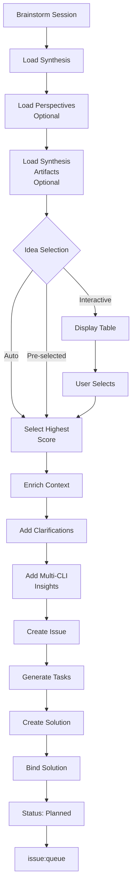

# issue:from-brainstorm

桥接命令，将 brainstorm-with-file 会话输出转换为可执行的 Issue + 解决方案，供 parallel-dev-cycle 使用。

## 描述

`issue:from-brainstorm` 命令将头脑风暴会话的创意转换为结构化的 Issue 和可执行的解决方案。它加载综合结果、选择创意、使用多 CLI 视角丰富上下文，并生成基于任务的解决方案以供执行。

### 关键特性

- **创意选择**：交互式或自动（最高评分）选择
- **上下文丰富**：添加澄清和多视角洞察
- **自动任务生成**：从创意的 next_steps 创建结构化任务
- **优先级计算**：从创意评分推导优先级 (0-10 → 1-5)
- **直接绑定**：解决方案自动绑定到 Issue
- **会话元数据**：在 Issue 中保留头脑风暴来源

## 用法

```bash
# 交互模式 - 从表格中选择创意
/issue:from-brainstorm SESSION="BS-rate-limiting-2025-01-28"

# 自动模式 - 选择评分最高的创意
/issue:from-brainstorm SESSION="BS-caching-2025-01-28" --auto

# 按索引预选创意
/issue:from-brainstorm SESSION="BS-auth-system-2025-01-28" --idea=0

# 自动模式并跳过确认
/issue:from-brainstorm SESSION="BS-caching-2025-01-28" --auto -y
```

### 参数

| 参数 | 必填 | 描述 |
|----------|----------|-------------|
| `SESSION` | 是 | 会话 ID 或 `.workflow/.brainstorm/BS-xxx` 路径 |
| `--idea <index>` | 否 | 按索引预选创意（从 0 开始） |
| `--auto` | 否 | 自动选择评分最高的创意 |
| `-y, --yes` | 否 | 跳过所有确认 |

## 示例

### 交互模式

```bash
/issue:from-brainstorm SESSION="BS-rate-limiting-2025-01-28"
# Output:
# | # | Title | Score | Feasibility |
# |---|-------|-------|-------------|
# | 0 | Token Bucket Algorithm | 8.5 | High |
# | 1 | Sliding Window Counter | 7.2 | Medium |
# | 2 | Fixed Window | 6.1 | High |
#
# Select idea: #0
#
# ✓ Created issue: ISS-20250128-001
# ✓ Created solution: SOL-ISS-20250128-001-ab3d
# ✓ Bound solution to issue
# → Status: planned
# → Next: /issue:queue
```

### 自动模式

```bash
/issue:from-brainstorm SESSION="BS-caching-2025-01-28" --auto
# Output:
# Auto-selected: Redis Cache Layer (Score: 9.2/10)
# ✓ Created issue: ISS-20250128-002
# ✓ Solution with 4 tasks:
#   - T1: Research & Validate Approach
#   - T2: Design & Create Specification
#   - T3: Implement Redis Cache Layer
#   - T4: Write Integration Tests
# → Status: planned
```

### 预选创意

```bash
/issue:from-brainstorm SESSION="BS-auth-system-2025-01-28" --idea=1
# 跳过选择，使用索引 1 的创意
```

## Issue 生命周期流程



## 会话文件

### 输入文件

```
.workflow/.brainstorm/BS-{slug}-{date}/
├── synthesis.json              # 必需 - 带评分的最佳创意
├── perspectives.json           # 可选 - 多 CLI 洞察
├── brainstorm.md              # 仅参考
└── .brainstorming/            # 可选 - 综合产物
    ├── system-architect/
    │   └── analysis.md        # 包含澄清
    ├── api-designer/
    │   └── analysis.md
    └── ...
```

### 综合 Schema

```typescript
interface Synthesis {
  session_id: string;
  topic: string;
  completed_at: string;
  top_ideas: Idea[];
}

interface Idea {
  index: number;
  title: string;
  description: string;
  score: number;                // 0-10
  novelty: number;              // 0-10
  feasibility: 'Low' | 'Medium' | 'High';
  key_strengths: string[];
  main_challenges: string[];
  next_steps: string[];
}
```

## 上下文丰富

### 基础上下文（始终包含）

```markdown
## Idea Description
{idea.description}

## Why This Idea
{idea.key_strengths}

## Challenges to Address
{idea.main_challenges}

## Implementation Steps
{idea.next_steps}
```

### 增强上下文（如可用）

#### 来自综合产物

```markdown
## Requirements Clarification (system-architect)
Q: How will this integrate with existing auth?
A: Will use adapter pattern to wrap current system

## Architecture Feasibility (api-designer)
Q: What API changes are needed?
A: New /oauth/* endpoints, backward compatible
```

#### 来自多 CLI 视角

```markdown
## Creative Perspective
Insight: Consider gamification to improve adoption

## Pragmatic Perspective
Blocker: Current rate limiter lacks configuration

## Systematic Perspective
Pattern: Token bucket provides better burst handling
```

## 任务生成策略

### 任务 1：研究与验证

**触发条件**：`idea.main_challenges.length > 0`

```typescript
{
  id: "T1",
  title: "Research & Validate Approach",
  scope: "design",
  action: "Research",
  implementation: [
    "Investate identified blockers",
    "Review similar implementations in industry",
    "Validate approach with team/stakeholders"
  ],
  acceptance: {
    criteria: [
      "Blockers documented with resolution strategies",
      "Feasibility assessed with risk mitigation",
      "Approach validated with key stakeholders"
    ],
    verification: [
      "Research document created",
      "Stakeholder approval obtained",
      "Risk assessment completed"
    ]
  },
  priority: 1
}
```

### 任务 2：设计与规格

**触发条件**：`idea.key_strengths.length > 0`

```typescript
{
  id: "T2",
  title: "Design & Create Specification",
  scope: "design",
  action: "Design",
  implementation: [
    "Create detailed design document",
    "Define success metrics and KPIs",
    "Plan implementation phases"
  ],
  acceptance: {
    criteria: [
      "Design document complete with diagrams",
      "Success metrics defined and measurable",
      "Implementation plan with timeline"
    ],
    verification: [
      "Design reviewed and approved",
      "Metrics tracked in dashboard",
      "Phase milestones defined"
    ]
  },
  priority: 2
}
```

### 任务 3+：实现任务

**触发条件**：`idea.next_steps[]`

每个 next_step 成为一个任务：

```typescript
{
  id: "T3",
  title: "{next_steps[0]}",  // max 60 chars
  scope: inferScope(step),    // backend, frontend, infra...
  action: detectAction(step), // Implement, Create, Update...
  implementation: [
    "Execute: {next_steps[0]}",
    "Follow design specification",
    "Write unit and integration tests"
  ],
  acceptance: {
    criteria: [
      "Step implemented per design",
      "Tests passing with coverage >80%",
      "Code reviewed and approved"
    ],
    verification: [
      "Functional tests pass",
      "Code coverage meets threshold",
      "Review approved"
    ]
  },
  priority: 3
}
```

### 回退任务

**触发条件**：以上未生成任何任务

```typescript
{
  id: "T1",
  title: idea.title,
  scope: "implementation",
  action: "Implement",
  implementation: [
    "Analyze requirements and context",
    "Design solution approach",
    "Implement core functionality",
    "Write comprehensive tests",
    "Document changes and usage"
  ],
  acceptance: {
    criteria: [
      "Core functionality working",
      "Tests passing",
      "Documentation complete"
    ],
    verification: [
      "Manual testing successful",
      "Automated tests pass",
      "Docs reviewed"
    ]
  },
  priority: 3
}
```

## 优先级计算

### Issue 优先级

```javascript
// idea.score: 0-10 → priority: 1-5
priority = max(1, min(5, ceil((10 - score) / 2)))

Examples:
score 9-10 → priority 1 (critical)
score 7-8  → priority 2 (high)
score 5-6  → priority 3 (medium)
score 3-4  → priority 4 (low)
score 0-2  → priority 5 (lowest)
```

### 任务优先级

- 研究任务：1（最高 - 验证方法）
- 设计任务：2（高 - 实现的基础）
- 实现任务：默认 3
- 测试/文档：4-5（较低优先级）

## 输出结构

### 创建的 Issue

```typescript
interface Issue {
  id: string;                    // ISS-YYYYMMDD-NNN
  title: string;                 // 来自 idea.title
  status: 'planned';             // 绑定后自动设置
  priority: number;              // 从评分推导
  context: string;               // 丰富后的描述
  source: 'brainstorm';
  labels: string[];              // ['brainstorm', perspective, feasibility]
  expected_behavior: string;     // 来自 key_strengths
  actual_behavior: string;       // 来自 main_challenges
  affected_components: string[]; // 从描述中提取
  bound_solution_id: string;     // 自动绑定
  _brainstorm_metadata: {
    session_id: string;
    idea_score: number;
    novelty: number;
    feasibility: string;
    clarifications_count: number;
  };
}
```

### 创建的解决方案

```typescript
interface Solution {
  id: string;                    // SOL-{issue-id}-{4-char-uid}
  description: string;           // idea.title
  approach: string;              // idea.description
  tasks: Task[];
  analysis: {
    risk: 'low' | 'medium' | 'high';
    impact: 'low' | 'medium' | 'high';
    complexity: 'low' | 'medium' | 'high';
  };
  is_bound: true;
  created_at: string;
  bound_at: string;
}
```

## 集成流程

```
brainstorm-with-file
        │
        ├─ synthesis.json (top_ideas)
        ├─ perspectives.json (multi-CLI insights)
        └─ .brainstorming/** (synthesis artifacts)
        │
        ▼
issue:from-brainstorm ◄─── 本命令
        │
        ├─ ISS-YYYYMMDD-NNN (丰富后的 Issue)
        └─ SOL-{issue-id}-{uid} (结构化解决方案)
        │
        ▼
issue:queue
        │
        ▼
issue:execute
        │
        ▼
   完成解决方案
```

## 相关命令

- **[workflow:brainstorm-with-file](#)** - 生成头脑风暴会话
- **[workflow:brainstorm:synthesis](#)** - 为头脑风暴添加澄清
- **[issue:new](./issue-new.md)** - 从 GitHub 或文本创建 Issue
- **[issue:plan](./issue-plan.md)** - 为 Issue 规划解决方案
- **[issue:queue](./issue-queue.md)** - 形成执行队列
- **[issue:execute](./issue-execute.md)** - 使用 parallel-dev-cycle 执行

## CLI 端点

```bash
# Create issue
ccw issue create << 'EOF'
{
  "title": "...",
  "context": "...",
  "priority": 3,
  "source": "brainstorm",
  "labels": ["brainstorm", "creative", "feasibility-high"]
}
EOF

# Bind solution
ccw issue bind {issue-id} {solution-id}

# Update status
ccw issue update {issue-id} --status planned
```
