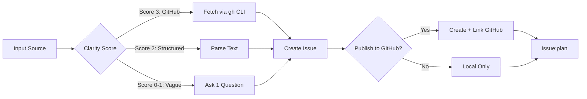
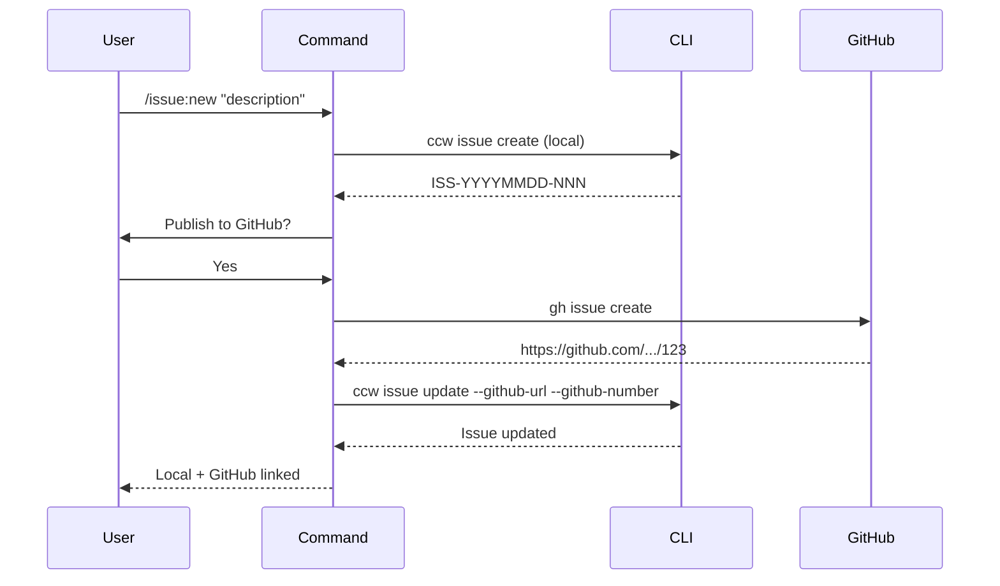

# issue:new

从 GitHub URL、文本描述或头脑风暴会话创建结构化 Issue，支持自动分类和优先级检测。

## 描述

`issue:new` 命令从多种输入源创建结构化 Issue，具备智能清晰度检测。仅在需要时提出澄清问题，同时支持本地和 GitHub 同步的 Issue。

### 关键特性

- **多来源输入**：GitHub URL、文本描述、结构化输入
- **清晰度检测**：仅对模糊输入提问
- **GitHub 集成**：可选发布到 GitHub 并支持双向同步
- **智能分类**：自动标签和优先级检测
- **ACE 集成**：轻量级代码库上下文用于受影响组件

## 用法

```bash
# 清晰输入 - 直接创建（无提问）
/issue:new https://github.com/owner/repo/issues/123
/issue:new "Login fails with special chars. Expected: success. Actual: 500"

# 模糊输入 - 将提出 1 个澄清问题
/issue:new "something wrong with auth"

# 覆盖优先级
/issue:new "Database connection times out" --priority 2

# 自动模式 - 跳过确认
/issue:new "Fix navigation bug" -y
```

### 参数

| 参数 | 必填 | 描述 |
|----------|----------|-------------|
| `input` | 是 | GitHub URL、Issue 描述或结构化文本 |
| `-y, --yes` | 否 | 跳过确认问题 |
| `--priority &lt;1-5&gt;` | 否 | 覆盖优先级 (1=严重, 5=低) |

## 示例

### 从 GitHub URL 创建

```bash
/issue:new https://github.com/owner/repo/issues/42
# Output: 通过 gh CLI 获取 Issue 详情，直接创建
```

### 使用结构化文本创建

```bash
/issue:new "Login fails with special chars. Expected: success. Actual: 500 error"
# Output: 解析结构，使用提取的字段创建 Issue
```

### 带澄清的创建

```bash
/issue:new "auth broken"
# 系统提问: "Please describe the issue in more detail:"
# 用户提供: "Users cannot log in when password contains quotes"
# 使用丰富的上下文创建 Issue
```

### 带 GitHub 发布的创建

```bash
/issue:new "Memory leak in WebSocket handler"
# 系统提问: "Would you like to publish to GitHub?"
# 用户选择: "Yes, publish to GitHub"
# Output:
#   Local issue: ISS-20251229-001
#   GitHub issue: https://github.com/org/repo/issues/123
#   Both linked bidirectionally
```

## Issue 生命周期流程



## Issue 字段

### 核心字段

| 字段 | 类型 | 描述 |
|-------|------|-------------|
| `id` | string | Issue ID (`GH-123` 或 `ISS-YYYYMMDD-NNN`) |
| `title` | string | Issue 标题（最多 60 字符） |
| `status` | enum | `registered` | `planned` | `queued` | `in_progress` | `completed` | `failed` |
| `priority` | number | 1（严重）到 5（低） |
| `context` | string | 问题描述（唯一真实来源） |
| `source` | enum | `github` | `text` | `discovery` | `brainstorm` | `converted` |

### 可选字段

| 字段 | 类型 | 描述 |
|-------|------|-------------|
| `source_url` | string | 原始来源 URL |
| `labels` | string[] | 分类标签 |
| `expected_behavior` | string | 期望的系统行为 |
| `actual_behavior` | string | 实际的问题行为 |
| `affected_components` | string[] | 相关文件/模块（通过 ACE） |
| `github_url` | string | 关联的 GitHub Issue URL |
| `github_number` | number | GitHub Issue 编号 |
| `feedback` | object[] | 失败历史和澄清 |

### 反馈 Schema

```typescript
interface Feedback {
  type: 'failure' | 'clarification' | 'rejection';
  stage: 'new' | 'plan' | 'execute';
  content: string;
  created_at: string;
}
```

## 清晰度检测

### 评分规则

| 评分 | 标准 | 行为 |
|-------|----------|----------|
| **3** | GitHub URL | 直接获取，无提问 |
| **2** | 结构化文本（包含 "expected:"、"actual:" 等） | 解析结构，可能使用 ACE 获取组件 |
| **1** | 长文本（>50 字符） | 如缺少组件信息则使用 ACE 快速提示 |
| **0** | 模糊/短文本 | 提出 1 个澄清问题 |

### 结构化文本模式

该命令识别以下关键词用于自动解析：
- `expected:` / `Expected:`
- `actual:` / `Actual:`
- `affects:` / `Affects:`
- `steps:` / `Steps:`

## GitHub 发布工作流



## 相关命令

- **[issue:plan](./issue-plan.md)** - 为 Issue 生成解决方案
- **[issue:queue](./issue-queue.md)** - 形成执行队列
- **[issue:discover](./issue-discover.md)** - 从代码库发现 Issue
- **[issue:from-brainstorm](./issue-from-brainstorm.md)** - 将头脑风暴转换为 Issue
- **[issue:convert-to-plan](./issue-convert-to-plan.md)** - 将计划转换为 Issue
- **[issue:execute](./issue-execute.md)** - 执行 Issue 队列

## CLI 端点

该命令使用以下 CLI 端点：

```bash
# Create issue
echo '{"title":"...","context":"...","priority":3}' | ccw issue create

# Update with GitHub binding
ccw issue update <id> --github-url "<url>" --github-number <num>

# View issue
ccw issue status <id> --json
```
