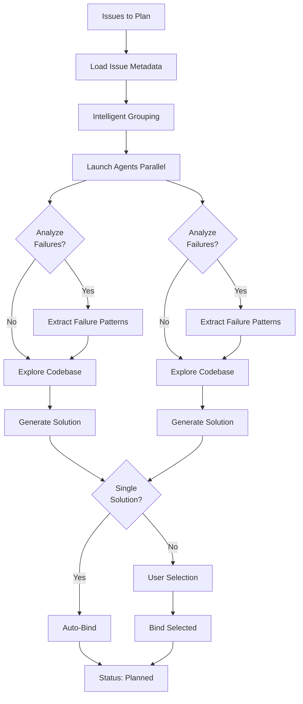

# issue:plan

使用智能 Agent 驱动的探索和规划，批量规划 Issue 解决方案，支持失败感知的重试逻辑。

## 描述

`issue:plan` 命令使用 issue-plan-agent 将探索和规划合并为单一的闭环工作流。它生成包含任务分解的可执行解决方案，处理之前的失败分析，并支持每个 Agent 最多处理 3 个 Issue 的批处理。

### 关键特性

- **探索 + 规划**：合并工作流以加速规划
- **失败感知**：分析之前的失败以避免重复
- **批处理**：对语义相似的 Issue 进行分组
- **自动绑定**：单一解决方案自动绑定
- **冲突检测**：识别跨 Issue 的文件冲突
- **GitHub 集成**：在适用时添加 GitHub 评论任务

## 用法

```bash
# 规划所有待处理的 Issue（默认）
/issue:plan

# 规划特定 Issue
/issue:plan GH-123,GH-124,GH-125

# 规划单个 Issue
/issue:plan ISS-20251229-001

# 显式指定全部待处理
/issue:plan --all-pending

# 自定义批大小
/issue:plan --batch-size 5
```

### 参数

| 参数 | 必填 | 描述 |
|----------|----------|-------------|
| `issue-ids` | 否 | 逗号分隔的 Issue ID（默认：所有待处理） |
| `--all-pending` | 否 | 显式标志处理所有待处理 Issue |
| `--batch-size <n>` | 否 | 每批最大 Issue 数（默认：3） |
| `-y, --yes` | 否 | 自动绑定无需确认 |

## 示例

### 规划所有待处理 Issue

```bash
/issue:plan
# Output:
# Found 5 pending issues
# Processing 5 issues in 2 batch(es)
# [Batch 1/2] Planning GH-123, GH-124, GH-125...
# ✓ GH-123: SOL-GH-123-a7x9 (3 tasks)
# ✓ GH-124: SOL-GH-124-b3m2 (4 tasks)
# ✓ GH-125: SOL-GH-125-c8k1 (2 tasks)
```

### 带失败重试的规划

```bash
/issue:plan ISS-20251229-001
# Agent 分析 issue.feedback 中的之前失败
# 避免之前失败的相同方法
# 创建带验证步骤的替代解决方案
```

### 多解决方案选择

```bash
/issue:plan GH-999
# Agent 生成 2 个替代解决方案
# Interactive prompt:
#   Issue GH-999: which solution to bind?
#   [1] SOL-GH-999-a1b2 (4 tasks) - Refactor approach
#   [2] SOL-GH-999-c3d4 (6 tasks) - Rewrite approach
```

## Issue 生命周期流程



## 规划工作流

### 阶段 1：Issue 加载

```bash
# 仅加载简要元数据（避免上下文溢出）
ccw issue list --status pending,registered --json
```

**返回**：`{id, title, tags}` 数组

### 阶段 2：Agent 探索（并行）

每个 Agent 执行：

1. **获取完整 Issue 详情**
   ```bash
   ccw issue status <id> --json
   ```

2. **分析失败历史**（如存在）
   - 提取 `issue.feedback` 中 `type='failure'`、`stage='execute'` 的记录
   - 解析 error_type、message、task_id、solution_id
   - 识别重复模式和根因
   - 设计替代方法

3. **加载项目上下文**
   - `.workflow/project-tech.json`（技术栈）
   - `.workflow/project-guidelines.json`（约束条件）

4. **探索代码库**（ACE 语义搜索）

5. **生成解决方案**（遵循 solution-schema.json）
   - 包含量化验收标准的任务
   - 防止相同失败的验证步骤
   - 在方法中引用之前的失败

6. **写入和绑定**
   - 写入 `solutions/{issue-id}.jsonl`
   - 单一解决方案时执行 `ccw issue bind <issue-id> <solution-id>`

### 阶段 3：解决方案选择

多个解决方案 → 用户通过 AskUserQuestion 选择

### 阶段 4：摘要

```bash
## Done: 5 issues → 5 planned

Bound Solutions:
- GH-123: SOL-GH-123-a7x9 (3 tasks)
- GH-124: SOL-GH-124-b3m2 (4 tasks)
- ISS-20251229-001: SOL-ISS-20251229-001-c8k1 (2 tasks)

Next: /issue:queue
```

## 失败感知规划

### 反馈 Schema

```typescript
interface FailureFeedback {
  type: 'failure';
  stage: 'execute';
  content: {
    task_id: string;
    solution_id: string;
    error_type: 'test_failure' | 'compilation' | 'timeout' | 'runtime_error';
    message: string;
    timestamp: string;
  };
  created_at: string;
}
```

### 失败分析规则

1. **提取模式**：重复错误表明系统性问题
2. **识别根因**：测试失败 vs 编译 vs 超时
3. **设计替代方案**：改变方法，而非仅改变实现
4. **添加预防措施**：针对相同错误的显式验证步骤
5. **记录教训**：在 solution.approach 中引用失败

## CLI 端点

### Issue 操作

```bash
# List pending issues (brief)
ccw issue list --status pending --brief

# Get full issue details (agent use)
ccw issue status <id> --json

# Bind solution to issue
ccw issue bind <issue-id> <solution-id>

# List with bound solutions
ccw issue solutions --status planned --brief
```

### 解决方案 Schema

```typescript
interface Solution {
  id: string;                    // SOL-{issue-id}-{4-char-uid}
  description: string;
  approach: string;
  tasks: Task[];
  exploration_context: {
    relevant_files: string[];
    dependencies: string[];
    patterns: string[];
  };
  failure_analysis?: {
    previous_failures: string[];
    alternative_approach: string;
    prevention_steps: string[];
  };
  is_bound: boolean;
  created_at: string;
  bound_at?: string;
}

interface Task {
  id: string;                    // T1, T2, T3...
  title: string;
  scope: string;
  action: string;
  implementation: string[];
  acceptance: {
    criteria: string[];
    verification: string[];
  };
  test?: {
    unit?: string[];
    integration?: string[];
    commands?: string[];
  };
}
```

## 相关命令

- **[issue:new](./issue-new.md)** - 规划前创建 Issue
- **[issue:queue](./issue-queue.md)** - 从已规划 Issue 形成执行队列
- **[issue:execute](./issue-execute.md)** - 执行已规划的解决方案
- **[issue:from-brainstorm](./issue-from-brainstorm.md)** - 将头脑风暴转换为已规划 Issue
- **[issue:convert-to-plan](./issue-convert-to-plan.md)** - 将现有计划转换为 Issue

## 最佳实践

1. **批量规划**：默认每批 3 个 Issue 以获得最优性能
2. **审查失败**：重新规划前检查 Issue 反馈
3. **验证冲突**：Agent 报告跨 Issue 的文件冲突
4. **GitHub Issue**：Agent 添加最终任务以评论 GitHub Issue
5. **验收标准**：确保任务具有量化的成功指标
6. **测试覆盖**：每个任务应包含验证步骤

## 故障排除

| 错误 | 原因 | 解决方案 |
|-------|-------|------------|
| 无待处理 Issue | 所有 Issue 已规划 | 创建新 Issue 或使用 --all-pending 标志 |
| Agent 超时 | 大型代码库探索 | 减少批大小或限制范围 |
| 未生成解决方案 | 上下文不足 | 提供更详细的 Issue 描述 |
| 解决方案冲突 | 多个 Issue 涉及相同文件 | Agent 报告冲突，手动解决 |
| 绑定失败 | 解决方案文件写入错误 | 检查权限，重试 |
