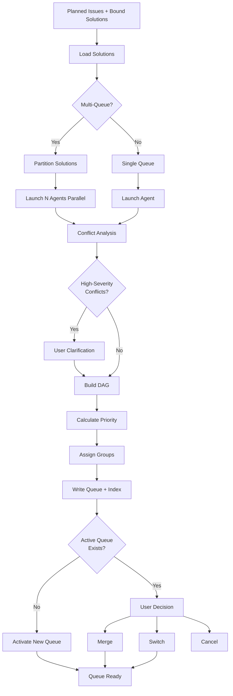

# issue:queue

使用 issue-queue-agent 的队列形成命令，分析绑定的解决方案、解决解决方案间的冲突，并创建有序的执行队列。

## 描述

`issue:queue` 命令从已规划的带绑定解决方案的 Issue 创建执行队列。它执行解决方案级别的冲突分析、构建依赖 DAG、计算语义优先级，并分配执行组（并行/顺序）。

### 关键特性

- **解决方案级粒度**：队列项是完整的解决方案，而非单个任务
- **冲突解决**：自动检测和用户澄清高严重性冲突
- **多队列支持**：创建并行队列用于分布式执行
- **语义优先级**：基于 Issue 优先级和任务复杂度的智能排序
- **基于 DAG 的分组**：并行 (P*) 和顺序 (S*) 执行组
- **队列历史**：跟踪所有队列并管理活动队列

## 用法

```bash
# 从所有绑定的解决方案形成新队列
/issue:queue

# 形成 3 个并行队列（分配解决方案）
/issue:queue --queues 3

# 仅为特定 Issue 形成队列
/issue:queue --issue GH-123

# 追加到活动队列
/issue:queue --append GH-124

# 列出所有队列
/issue:queue --list

# 切换活动队列
/issue:queue --switch QUE-xxx

# 归档已完成的队列
/issue:queue --archive
```

### 参数

| 参数 | 必填 | 描述 |
|----------|----------|-------------|
| `--queues <n>` | 否 | 并行队列数（默认：1） |
| `--issue <id>` | 否 | 仅为特定 Issue 形成队列 |
| `--append <id>` | 否 | 将 Issue 追加到活动队列 |
| `--force` | 否 | 跳过活动队列检查，始终创建新队列 |
| `-y, --yes` | 否 | 自动确认，使用推荐的解决方案 |

### CLI 子命令

```bash
ccw issue queue list                  # 列出所有队列及状态
ccw issue queue add <issue-id>        # 添加 Issue 到队列
ccw issue queue add <issue-id> -f     # 强制添加到新队列
ccw issue queue merge <src> --queue <target>  # 合并队列
ccw issue queue switch <queue-id>     # 切换活动队列
ccw issue queue archive               # 归档当前队列
ccw issue queue delete <queue-id>     # 从历史中删除队列
```

## 示例

### 创建单一队列

```bash
/issue:queue
# Output:
# Loading 5 bound solutions...
# Generating queue: QUE-20251227-143000
# Analyzing conflicts...
# ✓ Queue created: 5 solutions, 3 execution groups
#   - P1: S-1, S-2 (parallel)
#   - S1: S-3 (sequential)
#   - P2: S-4, S-5 (parallel)
# Next: /issue:execute --queue QUE-20251227-143000
```

### 创建多个并行队列

```bash
/issue:queue --queues 3
# 分配解决方案以最小化跨队列冲突
# 创建: QUE-20251227-143000-1, QUE-20251227-143000-2, QUE-20251227-143000-3
# 通过 queue_group: QGR-20251227-143000 关联
```

### 追加到现有队列

```bash
/issue:queue --append GH-124
# 检查活动队列是否存在
# 将新解决方案添加到活动队列末尾
# 重新计算执行组
```

## Issue 生命周期流程



## 执行组

### 并行组 (P*)

无文件冲突的解决方案可同时执行：

```
P1: S-1, S-2, S-3  → 3 个执行器并行工作
```

### 顺序组 (S*)

共享依赖的解决方案必须按顺序执行：

```
S1: S-4 → S-5 → S-6  → 依次执行
```

### 混合执行

```
P1: S-1, S-2 (parallel)
  ↓
S1: S-3 (sequential, waits for P1)
  ↓
P2: S-4, S-5 (parallel, waits for S1)
```

## 冲突类型

### 1. 文件冲突

解决方案修改相同文件：

```json
{
  "conflict_id": "CFT-1",
  "type": "file",
  "severity": "high",
  "solutions": ["S-1", "S-2"],
  "files": ["src/auth/login.ts"],
  "resolution": "sequential"
}
```

**解决方案**：S-1 在 S-2 之前在顺序组中执行

### 2. API 冲突

解决方案更改共享接口：

```json
{
  "conflict_id": "CFT-2",
  "type": "api",
  "severity": "high",
  "solutions": ["S-3", "S-4"],
  "interfaces": ["AuthService.login()"],
  "resolution": "sequential"
}
```

**解决方案**：用户澄清使用哪种方法

### 3. 数据冲突

解决方案修改相同的数据库 Schema：

```json
{
  "conflict_id": "CFT-3",
  "type": "data",
  "severity": "medium",
  "solutions": ["S-5", "S-6"],
  "tables": ["users"],
  "resolution": "sequential"
}
```

**解决方案**：S-5 在 S-6 之前

### 4. 依赖冲突

解决方案需要不兼容的版本：

```json
{
  "conflict_id": "CFT-4",
  "type": "dependency",
  "severity": "high",
  "solutions": ["S-7", "S-8"],
  "packages": ["redis@4.x vs 5.x"],
  "resolution": "clarification"
}
```

**解决方案**：用户选择版本或推迟一个解决方案

### 5. 架构冲突

解决方案具有对立的架构方法：

```json
{
  "conflict_id": "CFT-5",
  "type": "architecture",
  "severity": "medium",
  "solutions": ["S-9", "S-10"],
  "approaches": ["monolithic", "microservice"],
  "resolution": "clarification"
}
```

**解决方案**：用户选择方法或分离关注点

## 队列结构

### 目录布局

```
.workflow/issues/queues/
├── index.json                    # 队列索引（活动 + 历史）
├── QUE-20251227-143000.json      # 单个队列文件
├── QUE-20251227-143000-1.json    # 多队列分区 1
├── QUE-20251227-143000-2.json    # 多队列分区 2
└── QUE-20251227-143000-3.json    # 多队列分区 3
```

### 索引 Schema

```typescript
interface QueueIndex {
  active_queue_id: string | null;
  active_queue_group: string | null;
  queues: QueueEntry[];
}

interface QueueEntry {
  id: string;
  queue_group?: string;          // 关联多队列分区
  queue_index?: number;           // 组中位置（从 1 开始）
  total_queues?: number;          // 组中队列总数
  status: 'active' | 'archived' | 'deleted';
  issue_ids: string[];
  total_solutions: number;
  completed_solutions: number;
  created_at: string;
}
```

### 队列文件 Schema

```typescript
interface Queue {
  queue_id: string;
  queue_group?: string;
  solutions: QueueSolution[];
  execution_groups: ExecutionGroup[];
  conflicts: Conflict[];
  priority_order: string[];
  created_at: string;
}

interface QueueSolution {
  item_id: string;                // S-1, S-2, S-3...
  issue_id: string;
  solution_id: string;
  status: 'pending' | 'in_progress' | 'completed' | 'failed';
  task_count: number;
  files_touched: string[];
  priority_score: number;
}

interface ExecutionGroup {
  id: string;                     // P1, S1, P2...
  type: 'parallel' | 'sequential';
  items: string[];                // S-1, S-2...
}
```

## 澄清流程

当存在无明确解决方案的高严重性冲突时：

```bash
# Interactive prompt
[CFT-5] File conflict: src/auth/login.ts modified by both S-1 and S-2
  Options:
  [1] Sequential: Execute S-1 first, then S-2
  [2] Sequential: Execute S-2 first, then S-1
  [3] Merge: Combine changes into single solution
  [4] Defer: Remove one solution from queue

User selects: [1]

# Agent resumes with resolution
# Updates queue with sequential ordering: S1: [S-1, S-2]
```

## 相关命令

- **[issue:plan](./issue-plan.md)** - 排队前规划解决方案
- **[issue:execute](./issue-execute.md)** - 执行排队的解决方案
- **[issue:new](./issue-new.md)** - 创建 Issue 以规划和排队
- **ccw issue queue dag** - 查看依赖图
- **ccw issue next** - 从队列获取下一项

## 最佳实践

1. **先规划再排队**：确保所有 Issue 都有绑定的解决方案
2. **审查冲突**：执行前检查冲突报告
3. **使用并行队列**：大项目中分配工作
4. **归档已完成**：保留队列历史以供参考
5. **检查未规划项**：审查已规划但未排队的 Issue
6. **验证 DAG**：确保无循环依赖

## CLI 端点

```bash
# List planned issues with bound solutions
ccw issue solutions --status planned --brief

# Create/update queue
ccw issue queue form

# Sync issue statuses from queue
ccw issue update --from-queue [queue-id]

# View queue DAG
ccw issue queue dag --queue <queue-id>

# Get next item
ccw issue next --queue <queue-id>
```
