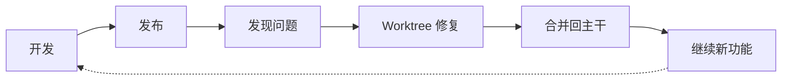

# 工作流介绍

CCW 提供两个工作流系统：**主工作流** 和 **问题工作流**，协同工作以覆盖完整的软件开发生命周期。

## 工作流架构概览

```mermaid
graph TB
    subgraph Main["主工作流（5 个级别）"]
        L1["级别 1：快速<br/>lite-lite-lite"]
        L2["级别 2：轻量<br/>lite-plan, lite-fix, multi-cli-plan"]
        L3["级别 3：标准<br/>plan, tdd-plan, test-fix-gen"]
        L4["级别 4：头脑风暴<br/>brainstorm:auto-parallel"]
        L5["级别 5：智能<br/>ccw-coordinator"]
        L1 --> L2 --> L3 --> L4 --> L5
    end

    subgraph Issue["问题工作流（开发后）"]
        I1["阶段 1：积累<br/>discover, new"]
        I2["阶段 2：解决<br/>plan, queue, execute"]
        I1 --> I2
    end

    Main -.->|开发完成后| Issue

    classDef level1 fill:#e3f2fd,stroke:#1976d2
    classDef level2 fill:#bbdefb,stroke:#1976d2
    classDef level3 fill:#90caf9,stroke:#1976d2
    classDef level4 fill:#64b5f6,stroke:#1976d2
    classDef level5 fill:#42a5f5,stroke:#1976d2
    classDef issue fill:#fff3e0,stroke:#f57c00

    class L1 level1,L2 level2,L3 level3,L4 level4,L5 level5,I1,I2 issue
```

## 主工作流 vs 问题工作流

| 方面 | 主工作流 | 问题工作流 |
|------|----------|-----------|
| **用途** | 主要开发周期 | 开发后维护 |
| **时机** | 功能开发阶段 | 主工作流完成后 |
| **范围** | 完整功能实现 | 定向修复/增强 |
| **并行方式** | 依赖分析 + 代理并行 | Worktree 隔离（可选） |
| **分支模型** | 在当前分支上工作 | 可使用隔离的 worktree |

### 为什么主工作流不自动使用 Worktree？

**依赖分析已经解决了并行问题**：

1. 规划阶段（`/workflow:plan`）执行依赖分析
2. 自动识别任务依赖和关键路径
3. 划分为**并行组**（独立任务）和**串行链**（依赖任务）
4. 代理无需文件系统隔离即可并行执行独立任务

```mermaid
graph TD
    subgraph Dependency["依赖分析"]
        A["任务 A"]
        B["任务 B"]
        C["任务 C"]
        D["任务 D"]

        A & B --> PG["并行组 1<br/>代理 1"]
        C --> SC["串行链<br/>代理 2"]
        D --> SC

        PG --> R["结果"]
        SC --> R
    end

    classDef pg fill:#c8e6c9,stroke:#388e3c
    classDef sc fill:#fff9c4,stroke:#f57c00

    class PG pg,SC sc
```

### 为什么问题工作流支持 Worktree？

问题工作流作为**补充机制**，有不同的使用场景：

1. 主要开发完成，已合并到 `main`
2. 发现需要修复的问题
3. 需要在不影响当前开发的情况下修复
4. Worktree 隔离保持主分支稳定



## 15 个工作流级别详解

### 级别 1：快速执行
**复杂度**：低 | **产物**：无 | **状态**：无状态

| 工作流 | 描述 |
|--------|------|
| `lite-lite-lite` | 零开销的超轻量级直接执行 |

**最佳适用**：快速修复、简单功能、配置调整

---

### 级别 2：轻量规划
**复杂度**：低-中 | **产物**：内存/轻量文件 | **状态**：会话范围

| 工作流 | 描述 |
|--------|------|
| `lite-plan` | 适用于明确需求的内存规划 |
| `lite-fix` | 智能缺陷诊断和修复 |
| `multi-cli-plan` | 多 CLI 协作分析 |

**最佳适用**：单模块功能、缺陷修复、技术选型

---

### 级别 2.5：过渡工作流
**复杂度**：低-中 | **用途**：从轻量到问题工作流的过渡

| 工作流 | 描述 |
|--------|------|
| `rapid-to-issue` | 从快速规划过渡到问题工作流 |

**最佳适用**：将轻量计划转换为问题跟踪

---

### 级别 3：标准规划
**复杂度**：中-高 | **产物**：持久化会话文件 | **状态**：完整会话管理

| 工作流 | 描述 |
|--------|------|
| `plan` | 5 阶段的复杂功能开发 |
| `tdd-plan` | 红-绿-重构的测试驱动开发 |
| `test-fix-gen` | 渐进式层级的测试修复生成 |

**最佳适用**：多模块变更、重构、TDD 开发

---

### With-File 工作流（级别 3-4）
**复杂度**：中-高 | **产物**：文档化探索 | **多 CLI**：是

| 工作流 | 描述 | 级别 |
|--------|------|------|
| `brainstorm-with-file` | 多视角构思 | 4 |
| `debug-with-file` | 假设驱动调试 | 3 |
| `analyze-with-file` | 协作分析 | 3 |

**最佳适用**：带多 CLI 协作的文档化探索

---

### 级别 4：头脑风暴
**复杂度**：高 | **产物**：多角色分析文档 | **角色数**：3-9

| 工作流 | 描述 |
|--------|------|
| `brainstorm:auto-parallel` | 带综合的多角色头脑风暴 |

**最佳适用**：新功能设计、架构重构、探索性需求

---

### 级别 5：智能编排
**复杂度**：所有级别 | **产物**：完整状态持久化 | **自动化**：完整

| 工作流 | 描述 |
|--------|------|
| `ccw-coordinator` | 自动分析并推荐命令链 |

**最佳适用**：复杂多步骤工作流、不确定使用哪些命令、端到端自动化

---

### 问题工作流
**复杂度**：可变 | **产物**：问题记录 | **隔离**：Worktree 可选

| 阶段 | 命令 |
|------|------|
| **积累** | `discover`, `discover-by-prompt`, `new` |
| **解决** | `plan --all-pending`, `queue`, `execute` |

**最佳适用**：开发后问题修复、维护主分支稳定性

## 选择合适的工作流

### 快速选择表

| 场景 | 推荐工作流 | 级别 |
|------|-----------|------|
| 快速修复、配置调整 | `lite-lite-lite` | 1 |
| 明确的单模块功能 | `lite-plan -> lite-execute` | 2 |
| 缺陷诊断和修复 | `lite-fix` | 2 |
| 生产环境紧急情况 | `lite-fix --hotfix` | 2 |
| 技术选型、方案对比 | `multi-cli-plan -> lite-execute` | 2 |
| 多模块变更、重构 | `plan -> verify -> execute` | 3 |
| 测试驱动开发 | `tdd-plan -> execute -> tdd-verify` | 3 |
| 测试失败修复 | `test-fix-gen -> test-cycle-execute` | 3 |
| 新功能、架构设计 | `brainstorm:auto-parallel -> plan -> execute` | 4 |
| 复杂多步骤工作流、不确定使用哪些命令 | `ccw-coordinator` | 5 |
| 开发后问题修复 | Issue Workflow | - |

### 决策流程图

```mermaid
flowchart TD
    Start([开始新任务]) --> Q0{开发后<br/>维护？}

    Q0 -->|是| IssueW["问题工作流<br/>discover -> plan -> queue -> execute"]
    Q0 -->|否| Q1{不确定使用<br/>哪些命令？}

    Q1 -->|是| L5["级别 5：ccw-coordinator<br/>自动分析并推荐"]
    Q1 -->|否| Q2{需求<br/>明确？}

    Q2 -->|不确定| L4["级别 4：brainstorm:auto-parallel<br/>多角色探索"]
    Q2 -->|明确| Q3{需要持久化<br/>会话？}

    Q3 -->|是| Q4{开发类型？}
    Q3 -->|否| Q5{需要多<br/>视角？}

    Q4 -->|标准| L3Std["级别 3：plan -> verify -> execute"]
    Q4 -->|TDD| L3TDD["级别 3：tdd-plan -> execute -> verify"]
    Q4 -->|测试修复| L3Test["级别 3：test-fix-gen -> test-cycle"]

    Q5 -->|是| L2Multi["级别 2：multi-cli-plan"]
    Q5 -->|否| Q6{缺陷修复？}

    Q6 -->|是| L2Fix["级别 2：lite-fix"]
    Q6 -->|否| Q7{需要规划？}

    Q7 -->|是| L2Plan["级别 2：lite-plan -> lite-execute"]
    Q7 -->|否| L1["级别 1：lite-lite-lite"]

    IssueW --> End([完成])
    L5 --> End
    L4 --> End
    L3Std --> End
    L3TDD --> End
    L3Test --> End
    L2Multi --> End
    L2Fix --> End
    L2Plan --> End
    L1 --> End

    classDef level1 fill:#e3f2fd,stroke:#1976d2
    classDef level2 fill:#bbdefb,stroke:#1976d2
    classDef level3 fill:#90caf9,stroke:#1976d2
    classDef level4 fill:#64b5f6,stroke:#1976d2
    classDef level5 fill:#42a5f5,stroke:#1976d2
    classDef issue fill:#fff3e0,stroke:#f57c00

    class L1 level1,L2Plan,L2Fix,L2Multi level2,L3Std,L3TDD,L3Test level3,L4 level4,L5 level5,IssueW issue
```

### 复杂度指标

系统根据关键词自动评估复杂度：

| 权重 | 关键词 |
|------|--------|
| +2 | refactor, migrate, architect, system |
| +2 | multiple, across, all, entire |
| +1 | integrate, api, database |
| +1 | security, performance, scale |

- **高复杂度**（>=4）：自动选择级别 3-4
- **中等复杂度**（2-3）：自动选择级别 2
- **低复杂度**（<2）：自动选择级别 1

## 最小执行单元

**定义**：必须作为原子组一起执行的命令集，以实现有意义的工作流里程碑。

| 单元名称 | 命令 | 用途 |
|----------|------|------|
| **快速实现** | lite-plan -> lite-execute | 轻量规划和执行 |
| **多 CLI 规划** | multi-cli-plan -> lite-execute | 多视角分析和执行 |
| **缺陷修复** | lite-fix -> lite-execute | 缺陷诊断和修复执行 |
| **验证规划** | plan -> plan-verify -> execute | 带验证的规划和执行 |
| **TDD 规划** | tdd-plan -> execute | 测试驱动开发规划和执行 |
| **测试验证** | test-fix-gen -> test-cycle-execute | 生成测试任务和执行测试修复周期 |
| **代码审查** | review-session-cycle -> review-cycle-fix | 完整审查周期和应用修复 |

## 下一步

- [级别 1：超轻量工作流](./level-1-ultra-lightweight.mdx) - 了解快速执行
- [级别 2：快速工作流](./level-2-rapid.mdx) - 轻量规划和缺陷修复
- [级别 3：标准工作流](./level-3-standard.mdx) - 完整规划和 TDD
- [级别 4：头脑风暴工作流](./level-4-brainstorm.mdx) - 多角色探索
- [级别 5：智能工作流](./level-5-intelligent.mdx) - 自动化编排
- [常见问题](./faq.mdx) - 常见问题解答
