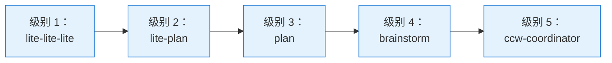

# 级别 1：超轻量工作流

**复杂度**：低 | **产物**：无 | **状态**：无状态 | **迭代**：通过 AskUser

最简单的工作流，用于即时处理简单任务 - 最小开销，直接执行。

## 概览

级别 1 工作流专为不需要规划、文档或持久化状态的快速简单任务而设计。它们从输入直接执行到完成。

```mermaid
flowchart LR
    Input([用户输入]) --> Clarify[澄清<br/>可选]
    Clarify --> Select{自动选择<br/>CLI}
    Select --> Analysis[并行分析<br/>多工具探索]
    Analysis --> Results[显示结果]
    Results --> Execute[直接执行]
    Execute --> Done([完成])

    classDef startend fill:#c8e6c9,stroke:#388e3c
    classDef action fill:#e3f2fd,stroke:#1976d2
    classDef decision fill:#fff9c4,stroke:#f57c00

    class Input,Done startend,Clarify,Select,Analysis,Results,Execute action,Select decision
```

## 包含的工作流：lite-lite-lite

### 命令

```bash
/workflow:lite-lite-lite
# 或 CCW 自动为简单任务选择
```

### 流程图

```mermaid
flowchart TD
    A([用户输入]) --> B{需要<br/>澄清？}
    B -->|是| C[AskUserQuestion<br/>目标/范围/约束]
    B -->|否| D[任务分析]
    C --> D

    D --> E{CLI 选择}
    E --> F[Gemini<br/>分析]
    E --> G[Codex<br/>实现]
    E --> H[Claude<br/>推理]

    F --> I[聚合结果]
    G --> I
    H --> I

    I --> J{直接<br/>执行？}
    J -->|是| K[直接执行]
    J -->|迭代| L[通过 AskUser 细化]
    L --> K

    K --> M([完成])

    classDef startend fill:#c8e6c9,stroke:#388e3c
    classDef action fill:#e3f2fd,stroke:#1976d2
    classDef decision fill:#fff9c4,stroke:#f57c00

    class A,M startend,B,E,J decision,C,D,F,G,H,I,K action
```

### 特性

| 属性 | 值 |
|------|-----|
| **复杂度** | 低 |
| **产物** | 无（无中间文件） |
| **状态** | 无状态 |
| **CLI 选择** | 自动分析任务类型 |
| **迭代** | 通过 AskUser 交互 |

### 处理阶段

1. **输入分析**
   - 解析用户输入的任务意图
   - 检测复杂度级别
   - 识别所需的 CLI 工具

2. **可选澄清**（如果 clarity_score < 2）
   - 目标：创建/修复/优化/分析
   - 范围：单文件/模块/跨模块
   - 约束：向后兼容/跳过测试/紧急热修复

3. **CLI 自动选择**
   - 任务类型 -> CLI 工具映射
   - 跨多个工具的并行分析
   - 聚合结果展示

4. **直接执行**
   - 立即执行变更
   - 无中间产物
   - 可选通过 AskUser 迭代

### CLI 选择逻辑

```javascript
function selectCLI(task) {
  const patterns = {
    'gemini': /analyze|review|understand|explore/,
    'codex': /implement|generate|create|write code/,
    'claude': /debug|fix|optimize|refactor/,
    'qwen': /consult|discuss|compare/
  };

  for (const [cli, pattern] of Object.entries(patterns)) {
    if (pattern.test(task)) return cli;
  }
  return 'gemini'; // Default
}
```

## 使用场景

### 适用场景

- 快速修复（简单拼写错误、小调整）
- 简单功能添加（单个函数、小型工具）
- 配置调整（环境变量、配置文件）
- 小范围重命名（变量名、函数名）
- 文档更新（readme、注释）

### 不适用场景

- 多模块变更（使用级别 2+）
- 需要持久化记录（使用级别 3+）
- 复杂重构（使用级别 3-4）
- 测试驱动开发（使用级别 3 TDD）
- 架构设计（使用级别 4-5）

## 示例

### 示例 1：快速修复

```bash
/workflow:lite-lite-lite "Fix typo in function name: getUserData"
```

**流程**：
1. 检测：简单拼写修复
2. 选择：Codex 进行重构
3. 执行：跨文件直接重命名
4. 完成：不生成产物

### 示例 2：简单功能

```bash
/workflow:lite-lite-lite "Add logging to user login function"
```

**流程**：
1. 检测：单模块功能
2. 选择：Claude 进行实现
3. 澄清：日志级别？输出目标？
4. 执行：添加日志语句
5. 完成：可运行的代码

### 示例 3：配置调整

```bash
/workflow:lite-lite-lite "Update API timeout to 30 seconds"
```

**流程**：
1. 检测：配置变更
2. 选择：Gemini 进行分析
3. 分析：查找所有超时配置
4. 执行：更新数值
5. 完成：配置已更新

## 优缺点

### 优点

| 优势 | 描述 |
|------|------|
| **速度** | 最快的工作流，零开销 |
| **简单** | 无需规划或文档 |
| **直接** | 输入 -> 执行 -> 完成 |
| **无产物** | 干净的工作区，无文件杂乱 |
| **低认知负担** | 简单直接的执行 |

### 缺点

| 限制 | 描述 |
|------|------|
| **无记录** | 没有变更的追踪记录 |
| **无规划** | 无法处理复杂任务 |
| **无审查** | 没有内置代码审查 |
| **范围有限** | 仅限单模块 |
| **无回滚** | 变更立即生效 |

## 与其他级别的对比

| 方面 | 级别 1 | 级别 2 | 级别 3 |
|------|--------|--------|--------|
| **规划** | 无 | 内存 | 持久化 |
| **产物** | 无 | 内存文件 | 会话文件 |
| **复杂度** | 低 | 低-中 | 中-高 |
| **可追溯性** | 无 | 部分 | 完整 |
| **审查** | 无 | 可选 | 内置 |

## 何时升级到更高级别

**需要级别 2+ 的迹象**：

- 任务涉及多个模块
- 需要跟踪进度
- 需求需要澄清
- 想要代码审查
- 需要测试生成

**升级路径**：



## 相关工作流

- [级别 2：快速工作流](./level-2-rapid.mdx) - 带规划的下一级别
- [级别 3：标准工作流](./level-3-standard.mdx) - 完整会话管理
- [常见问题](./faq.mdx) - 常见问题
